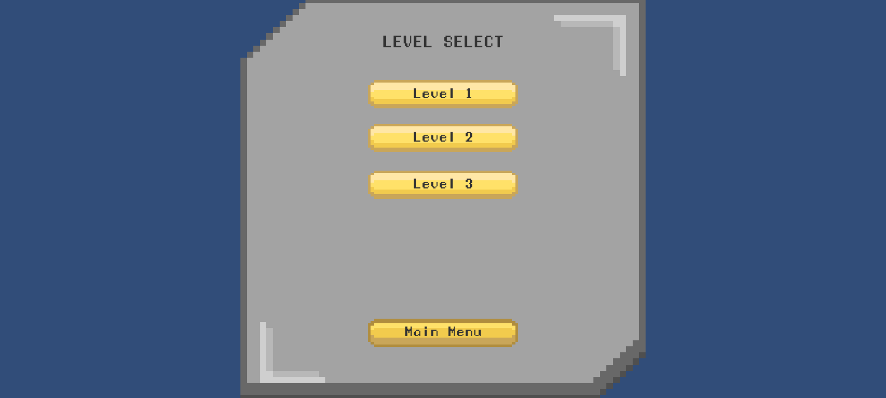
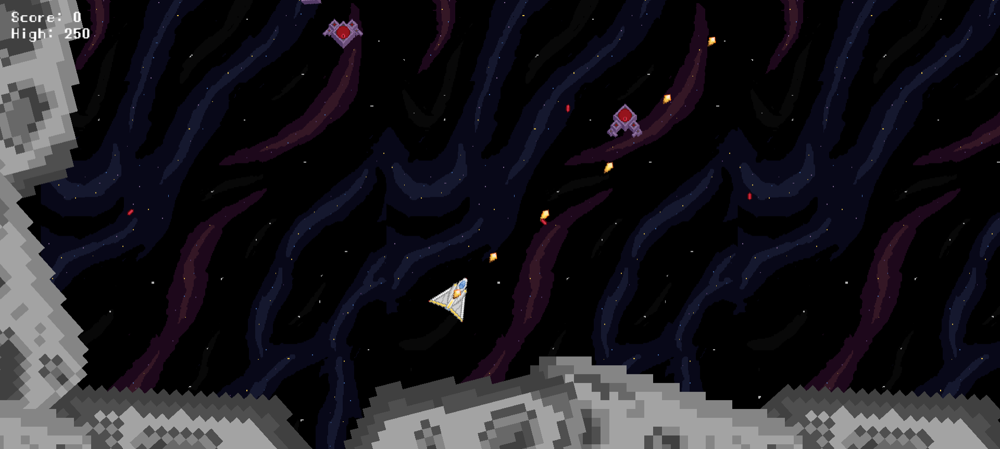
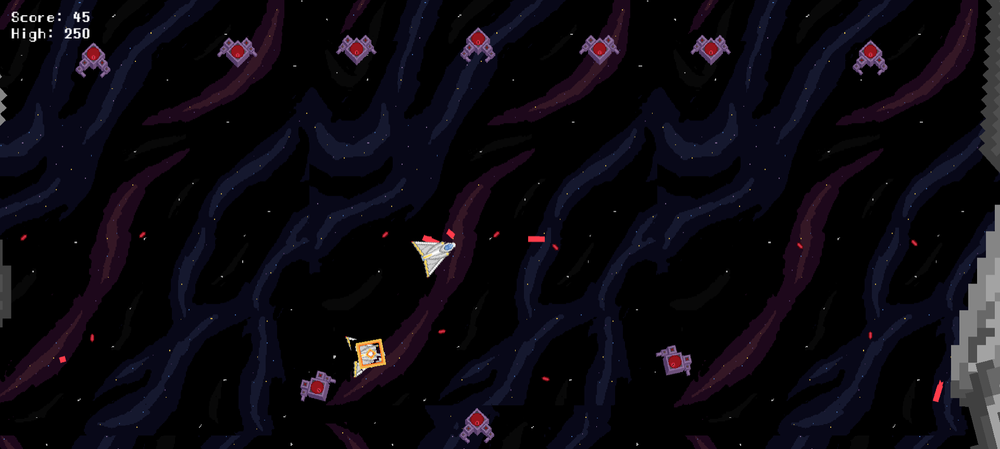
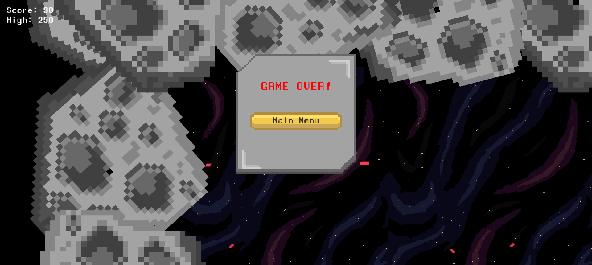
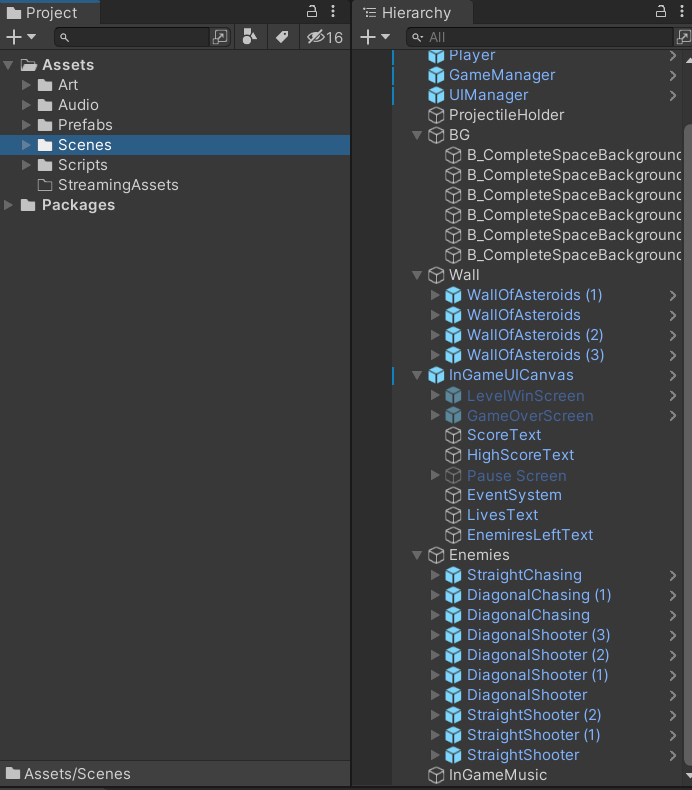

# 2D Shooter Game

:wave: My Project at Coursera :wave:

## Table of Contents
- [Description](#description)
- [Preview Screenshot](#preview-screenshot)
- [Technology](#technology)
- [Useful Resources](#useful-resources)
- [Contributors](#contributors)
- [License & Copyright](#license--copyright)

## Description
- This project is developed by following a crouse on Couresa
- This game work well for WebGL and Windows 
- Try out this game at: [2dshooterwithunity](https://thientmdenk.itch.io/2dshooterwithunity)

## Preview Screenshot

  </img> &nbsp;&nbsp; 
  </img> &nbsp;&nbsp; 
  </img> &nbsp;&nbsp;
  </img> &nbsp;&nbsp;
  </img> &nbsp;&nbsp;

  
## Technology
  - Visual Studio
  - UnityEngine
  - C#

## Useful Resources

#| Name | Description
-| ---- | -----------
1| [Coursera Course](https://www.coursera.org/learn/game-design-and-development-1) | Course that teaching this project
2| [2dshooterwithunity](https://thientmdenk.itch.io/2dshooterwithunity) | Play this game online

## Contributors
- [Tran Minh Thien](https://github.com/Denkhotieu) 

## License & Copyright
&copy; 2022 TranMinhThien.
